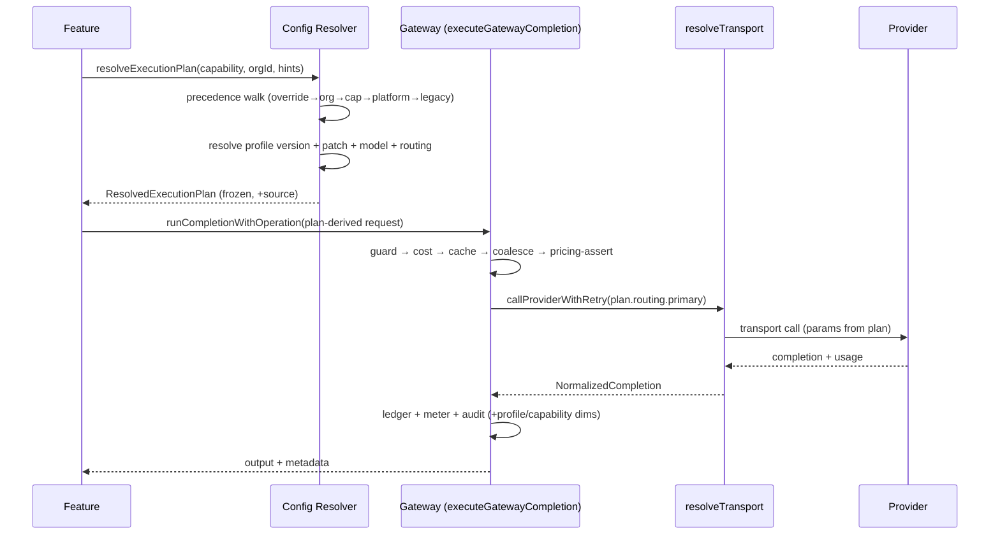
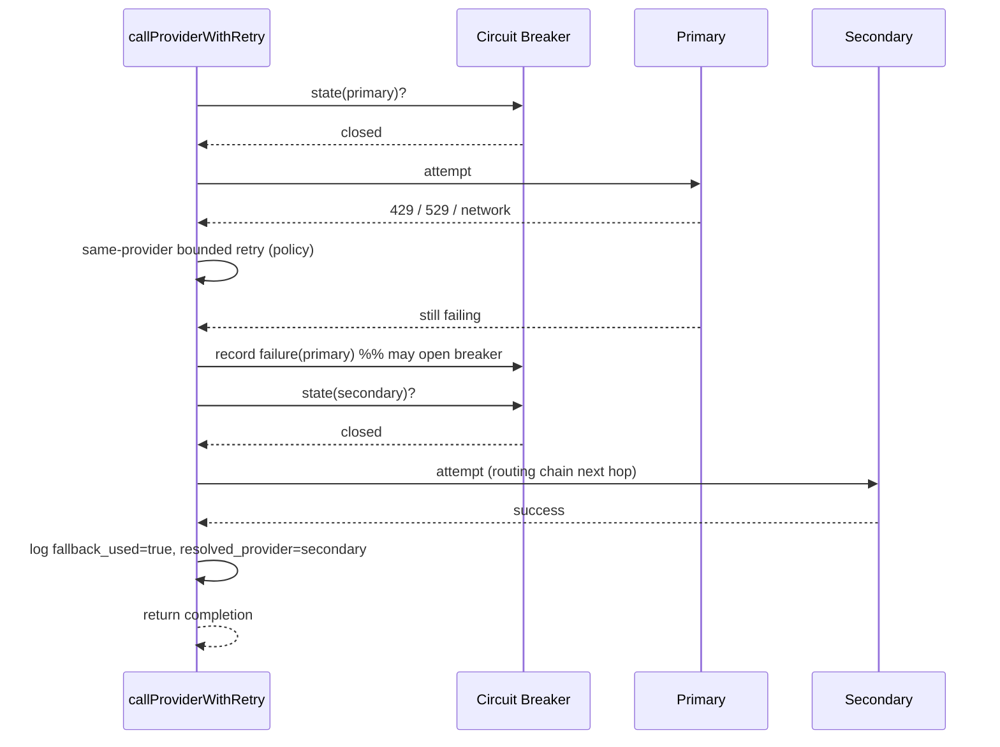
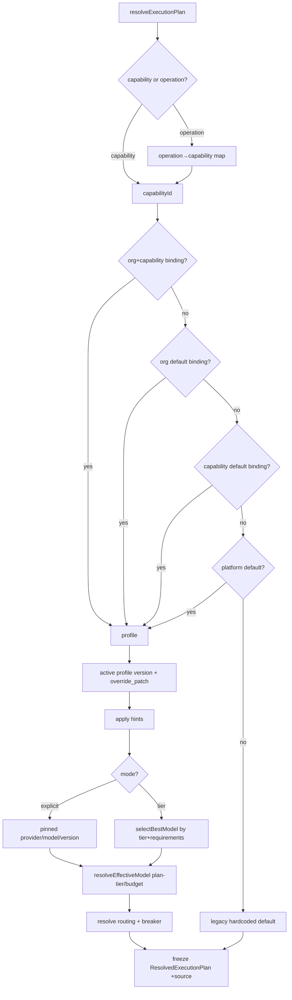
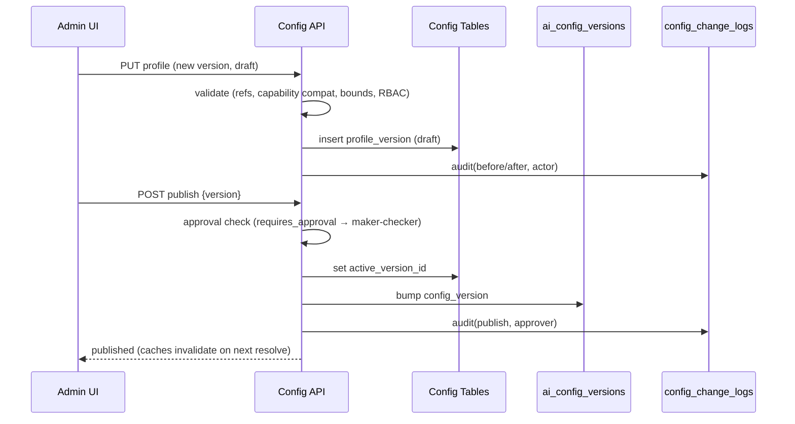
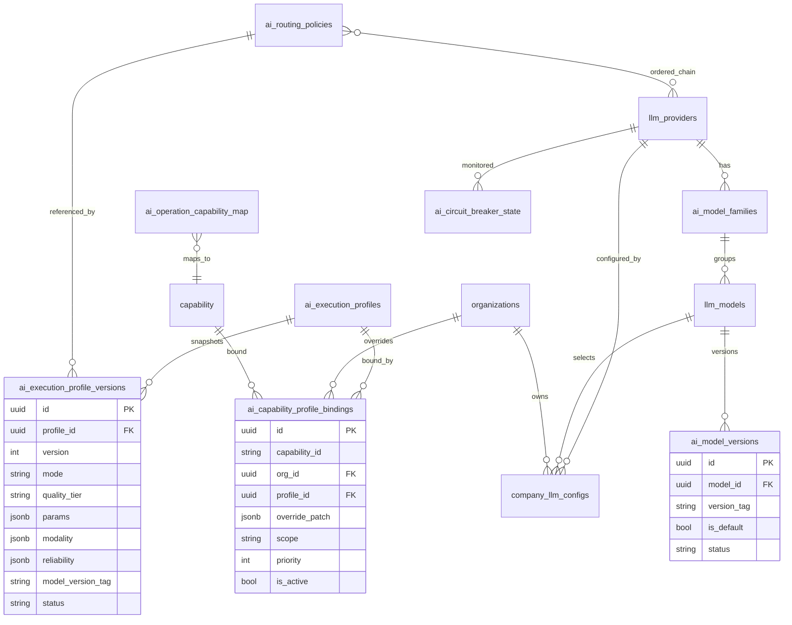

# OmniVYRA — Phase 2A: AI Orchestration Architecture & Database Design

**Type:** Architecture & design specification. **No code, migrations, or services were modified.** Design only.
**Extends:** the Phase 1 audit ([AI-ORCHESTRATION-READINESS-AUDIT.md](AI-ORCHESTRATION-READINESS-AUDIT.md)) and the canonical blueprint ([CANONICAL-AI-ARCHITECTURE.md](CANONICAL-AI-ARCHITECTURE.md), 14 ADRs).
**Governing constraint:** extend the existing gateway + capability framework; do not redesign working components; every increment additive, flag-gated, reversible, byte-identical when unconfigured.
**Date:** 2026-07-31.

---

## 1. Executive Summary

Phase 1 proved OmniVYRA already funnels ~130 consumers through one gateway (`executeGatewayCompletion`), has a per-tenant provider/model config schema (`llm_providers` / `llm_models` / `company_llm_configs`), and a capability framework (`CAPABILITY_REGISTRY` + `aiCapabilityRuntime`). What is missing is a **configuration plane that sits between a capability and the provider**: today "how to execute" (model, temperature, max_tokens, routing, retries) is hardcoded in TypeScript and scattered across call sites.

Phase 2A introduces **one new first-class abstraction — the Execution Profile** — and a **Configuration Resolver** that turns it into concrete execution at the two chokepoints the gateway already has. An Execution Profile is a named, versioned, tenant-overridable bundle of *execution intent* (quality tier, params, modality, reliability, cost ceilings) that is **decoupled from any specific provider or model**. A capability references a profile; the resolver walks a precedence chain (capability-override → org → capability-default → platform-default → legacy hardcoded) to produce a fully-resolved execution plan, which the existing gateway executes.

Nothing a feature calls changes. Features keep requesting a capability (or an operation). The resolver is inserted *behind* `resolveLlmConfig`/`resolveEffectiveModel`, so all ~130 consumers gain configuration-driven, provider-agnostic, version-aware routing transparently. When no profile is configured, resolution returns today's hardcoded default — **behavior is byte-identical until an admin opts in**.

**Design goals met:** configuration-driven (DB profiles), provider-agnostic (profiles name intent, not providers; the dispatcher already abstracts transport), capability-driven (capability→profile binding), version-aware (model-version + profile-version tables), multi-tenant (org-scoped overrides), backward-compatible (legacy fallback + flags), extensible (new provider = registry row + transport adapter, no schema change), observable (profile/capability/provider dimensions on existing `usage_events`), secure (RBAC + encrypted keys + audit + approval), low-maintenance (one resolver, one profile shape, no per-feature config).

---

## 2. Architecture Overview

### 2.1 Target execution chain (mapped to components)

```
Feature ─ requests ─▶ Capability
                          │
                          ▼
                  Execution Profile          ← NEW: named execution-intent bundle (DB)
                          │
                          ▼
              Configuration Resolver          ← NEW: precedence walk → ResolvedExecutionPlan
                          │
        ┌─────────────────┼──────────────────────────────┐
        ▼                 ▼                               ▼
     Provider        Model Family / Model / Version    Execution Params
   (routing policy)   (llm_providers/models/versions)  (temp, tokens, modality)
        │                 │                               │
        └─────────────────┴───────────────┬───────────────┘
                                          ▼
                                       Gateway                 ← EXISTING: executeGatewayCompletion
                                          │
                                          ▼
                                 Provider Transport            ← EXISTING: resolveTransport / dispatchTransport
                                          │
                                          ▼
                                       Response
```

### 2.2 Component responsibilities

| Component | New/Existing | Responsibility |
|---|---|---|
| **Capability** | Existing (`CAPABILITY_REGISTRY`) | Names *what* work is (CONTENT_WRITER, CAMPAIGN_PLANNER…). Owns knowledge/validation/output contract. Now also references a **default Execution Profile** instead of holding a hardcoded `config`. |
| **Execution Profile** | **NEW** (`ai_execution_profiles`) | Names *how* to execute (quality tier + params + modality + reliability + cost). Provider-agnostic. Versioned, tenant-overridable. |
| **Configuration Resolver** | **NEW** (`aiConfigResolver.ts`) | Pure function: `(capabilityId, orgId, operation, requestHints) → ResolvedExecutionPlan`. Walks precedence, merges override patches, resolves profile → provider/model/version/deployment/params, applies plan-tier + budget downgrade (reuses `aiModelRouter`), returns a frozen plan. Falls back to legacy default when unconfigured. |
| **Provider Routing / Fallback Policy** | **NEW** (`ai_routing_policies`) | Ordered provider chain (primary → secondary → fallback) + circuit-breaker policy referenced by a profile. Makes the implicit `getFallbackConfig` explicit and configurable. |
| **Provider / Model / Family / Version registry** | Extend existing | `llm_providers` (+priority/endpoint/deployment), `llm_models` (+family/capability flags), **NEW** `ai_model_versions`. |
| **Gateway funnel** | Existing (`executeGatewayCompletion`) | Executes the ResolvedExecutionPlan exactly as it executes a GatewayRequest today. `resolveLlmConfig`/`resolveEffectiveModel` become thin adapters over the resolver. |
| **Provider transport** | Existing (`resolveTransport`/`dispatchTransport`) | Byte-level provider I/O. Live path widened from `openai|anthropic` to `GatewayProviderId`. |
| **Admin plane** | **NEW UI** over mostly-existing endpoints | CRUD for providers/models/versions/profiles/capability-bindings/org-overrides with RBAC + validation + audit + approval + rollback. |
| **Observability** | Extend existing | `usage_events` + `recordAi` gain `execution_profile_id`, `profile_version`, `capability_id`, `resolved_provider`, `fallback_used` dimensions. |

### 2.3 Interaction sequence (normal call)

1. Feature calls a capability (or `runCompletionWithOperation` with an `operation`).
2. `aiCapabilityRuntime` (or the gateway funnel) invokes the **Configuration Resolver** with `(capability/operation, orgId, request hints)`.
3. Resolver produces a **ResolvedExecutionPlan** (provider chain, model, version, deployment, params, reliability, cost ceilings).
4. Plan handed to the gateway funnel, which runs the *existing* pipeline (guard → cost → cache → coalesce → provider-with-retry → ledger/audit) — now driven by the plan instead of literals.
5. `callProviderWithRetry` uses the plan's provider chain via `resolveTransport`; on failure it walks the fallback policy.
6. Response + full observability (profile/capability/provider dimensions) returned and logged.

The resolver is the **only** new thing on the hot path, and it is a pure, cached, fail-safe function.

---

## 3. Component Design

### 3.1 Configuration Resolver (`aiConfigResolver.ts` — new, single chokepoint)

```
resolveExecutionPlan(input: {
  capabilityId?: CapabilityId;      // preferred
  operation?: string;               // legacy consumers key on operation
  orgId?: string | null;
  requestHints?: {                  // caller may hint, never dictate provider
    preferStreaming?: boolean;
    requireStructured?: boolean;
    requireVision?: boolean;
    maxCostUsd?: number;
  };
}): ResolvedExecutionPlan
```

`ResolvedExecutionPlan` (frozen):
```
{
  capabilityId; operation; orgId;
  profileId; profileKey; profileVersion;
  routing: { providers: OrderedProvider[]; circuitBreakerPolicyId };
  model: { provider; family; modelKey; versionTag | null; deploymentId | null };
  params: { temperature; topP?; maxOutputTokens; reasoningLevel?; seedPolicy;
            streaming; structuredOutput; responseFormat?; toolCalling; vision };
  reliability: { timeoutMs; maxRetries; retryPolicy };
  limits: { maxCostUsdPerCall?; tokenCeiling? };
  caching: { cacheable; ttlSeconds? };
  safety: { moderation; safetyPolicyId? };
  source: 'capability_override' | 'org_default' | 'capability_default'
        | 'platform_default' | 'legacy_hardcoded';   // provenance for observability
}
```

Properties:
- **Pure + deterministic** given DB state; **request-scoped memoized** (same pattern as `resolveLlmConfig`'s `memoRequest`).
- **Fail-safe:** any resolution error → legacy hardcoded default + logged anomaly. Never throws on the hot path.
- **Cached:** short TTL in-process cache keyed by `(capabilityId|operation, orgId)` (mirrors `aiModelRouter`'s `_planCache`), invalidated on config write via a version bump.
- **Composes with `aiModelRouter`:** after profile resolution, the plan's model still passes through plan-tier + usage-budget downgrade (existing `resolveEffectiveModel`), preserving cost governance.

### 3.2 Adapters into existing chokepoints (no consumer change)

- `resolveLlmConfig(companyId)` → delegates to `resolveExecutionPlan` and maps to the existing `ResolvedLlmConfig` shape (provider/model/apiKey/isByok). BYOK key resolution (`resolveCompanyApiKey`) is unchanged but generalized beyond openai/anthropic.
- `resolveEffectiveModel(model, operation, orgId)` → still applies tiering, but the *input* model now comes from the resolved plan.
- `capabilityModelRunner` → reads params from the plan rather than the frozen `CAPABILITY_REGISTRY.config`.

### 3.3 Routing / fallback executor (extends `getFallbackConfig`)

The plan carries an ordered provider list + a circuit-breaker policy id. `callProviderWithRetry` is widened to iterate the list via `resolveTransport(providerId)` instead of the `openai|anthropic` ternary, consulting a per-provider circuit-breaker state before each attempt.

---

## 4. Execution Profile Design

An **Execution Profile** is the reusable answer to "how should this class of AI work run", decoupled from which feature asked and (optionally) from which provider serves it.

### 4.1 Profile intent kinds (seed catalog)

| Profile (key) | Intent | Typical resolution |
|---|---|---|
| `HIGH_QUALITY` | Best output, cost-tolerant | frontier tier, low temp, high token budget, retries on |
| `BALANCED` | Default | mid tier, moderate temp |
| `ECONOMY` | Cheap/fast bulk | mini tier, tight tokens, aggressive cache |
| `JSON_EXTRACTION` | Deterministic structured | temp 0, `structuredOutput=true`, structured-capable provider |
| `DEEP_REASONING` | Multi-step analysis | frontier tier, `reasoningLevel=high`, long timeout |
| `CREATIVE_WRITING` | Long-form copy | mid/high tier, higher temp, large max_tokens, streaming |
| `GROUNDED_RESEARCH` | Web-cited answers | search-capable provider (Perplexity), citations on |
| `VISION_ANALYSIS` | Image input | vision-capable provider/model |
| `IMAGE_GENERATION` | Image output (sibling seam) | image-capable provider/model, size/quality params |
| `MODERATION` | Safety classification | temp 0, tiny tokens, cheap tier |

Profiles are seeded to mirror today's hardcoded behavior 1:1 (so migration is a no-op), then tuned by admins.

### 4.2 Configurable properties (complete)

**Identity & lifecycle:** `key`, `name`, `description`, `version`, `status` (draft | active | deprecated | archived), `created_by`, `updated_by`, timestamps.

**Model-selection intent (one of two modes):**
- *Tier mode* (provider-agnostic): `quality_tier` (economy | balanced | high | frontier) + `capability_requirements` (needs_structured, needs_streaming, needs_vision, needs_search, needs_tools). The resolver picks the best DB model satisfying the tier + requirements.
- *Explicit mode* (pinned): `provider_id`, `model_family_id`, `model_id`, `model_version_tag` (nullable → provider default), `deployment_id` (nullable).

**Provider routing:** `routing_policy_id` (→ ordered provider chain + circuit-breaker) OR inline `primary/secondary/fallback` provider refs.

**Execution parameters:** `temperature`, `top_p`, `max_output_tokens`, `reasoning_level`, `seed_policy` (none | fixed | per_request), `stop_sequences`, `frequency_penalty`, `presence_penalty`.

**Modality / features:** `streaming` (bool), `structured_output` (bool), `response_format` (text | json_object | json_schema), `json_schema_ref` (nullable), `tool_calling` (bool), `vision` (bool), `image_params` (size/quality/n — for image profiles).

**Reliability:** `timeout_ms`, `max_retries`, `retry_policy` (backoff strategy ref), `circuit_breaker_policy_id`, `partial_allowed` (bool).

**Cost / limits:** `max_cost_usd_per_call` (nullable), `token_ceiling` (nullable), `rate_limit_hint`.

**Caching:** `cacheable` (bool), `cache_ttl_seconds` (nullable).

**Safety:** `moderation` (off | inbound | outbound | both), `safety_policy_id` (nullable), `prompt_injection_guard` (bool).

**Governance:** `is_platform_default` (bool — exactly one), `requires_approval` (bool), `experiment_id` (nullable → A/B).

### 4.3 Profile immutability & versioning

A profile row is a *pointer to the current active version*; edits create a new immutable `ai_execution_profile_versions` snapshot. Resolution records the exact `profile_version` used, so a config change never retroactively rewrites what a past call executed. Rollback = repoint the profile to a prior version (see §8).

---

## 5. Capability Configuration

### 5.1 Binding model

A capability no longer owns a hardcoded `config`. Instead it is **bound** to an Execution Profile through `ai_capability_profile_bindings`, at three scopes:

```
Platform Default Profile        (global fallback, org_id NULL, capability_id NULL, is_platform_default)
        ▲ overridden by
Capability Default Binding       (capability_id set, org_id NULL)
        ▲ overridden by
Organization Default Binding     (org_id set, capability_id NULL)   ← org-wide profile for all capabilities
        ▲ overridden by
Capability Override Binding      (org_id set, capability_id set)    ← most specific
```

Each binding references a `profile_id` and may carry an optional **override patch** (`override_patch jsonb`) — a sparse set of field-level overrides deep-merged onto the referenced profile. This lets an org say "use BALANCED but bump `max_output_tokens` for CONTENT_WRITER" without cloning the whole profile.

### 5.2 Capability registry evolution

`CAPABILITY_REGISTRY` (`aiCapability/capabilityRegistry.ts`) is retained for identity/knowledge/validation/output-contract, but its `config` block becomes the **legacy fallback default** — used only when no DB binding exists. The frozen TS values seed the initial `ai_execution_profiles` + `ai_capability_profile_bindings` rows 1:1, guaranteeing byte-identical behavior at cutover.

### 5.3 Operation-keyed compatibility

The ~80 legacy `operation` names (non-`aiCapability` consumers) are mapped to capabilities via an `operation → capability_id` lookup (seeded from `FEATURE_AREA_MAP` + `contextTypeMap`). Unmapped operations resolve to a `GENERIC_COMPLETION` capability bound to `BALANCED`. This gives every one of the ~130 consumers a resolution path without touching call sites.

---

## 6. Configuration Resolution

### 6.1 Precedence (highest → lowest priority)

```
1. Capability Override Binding     (org_id = X, capability_id = C)          most specific
2. Organization Default Binding    (org_id = X, capability_id = NULL)
3. Capability Default Binding      (org_id = NULL, capability_id = C)
4. Platform Default Profile        (is_platform_default = true)
5. Legacy Hardcoded Default        (CAPABILITY_REGISTRY.config / call-site literal)   safety net
```

### 6.2 Algorithm

```
resolveExecutionPlan(capabilityId, orgId, operation, hints):
  capabilityId ??= operationToCapability(operation) ?? 'GENERIC_COMPLETION'

  # 1. select the winning binding by precedence
  binding = firstNonNull(
     lookupBinding(orgId, capabilityId),        # 1
     lookupBinding(orgId, NULL),                # 2  (org-wide)
     lookupBinding(NULL, capabilityId),         # 3
     platformDefaultBinding())                  # 4
  if binding is null:
     return legacyPlan(capabilityId, operation) # 5  (byte-identical to today)

  # 2. resolve the profile version and apply the binding's override patch
  profile = activeVersionOf(binding.profile_id)
  effective = deepMerge(profile, binding.override_patch)

  # 3. apply request hints (may TIGHTEN, never silently pick an unsupported provider)
  effective = applyHints(effective, hints)      # e.g. requireStructured → structured-capable model

  # 4. resolve model
  if effective.mode == 'explicit':
     model = { provider, family, modelKey, versionTag ?? providerDefaultVersion, deploymentId }
  else:  # tier mode
     model = selectBestModel(effective.quality_tier, effective.capability_requirements, orgId)
             # honors company_llm_configs (BYOK/company model) first, else platform model catalog

  # 5. apply plan-tier + budget governance (reuse existing aiModelRouter)
  model.modelKey = resolveEffectiveModel(model.modelKey, capabilityId, orgId)

  # 6. resolve routing/fallback + circuit-breaker
  routing = resolveRoutingPolicy(effective.routing_policy_id, model.provider)

  # 7. assemble + freeze plan, tag provenance = winning layer
  return freeze(ResolvedExecutionPlan{ ..., source: binding.scope })
```

### 6.3 Merge semantics

- **Binding references a whole profile**, then a **sparse `override_patch`** is deep-merged (patch wins field-by-field). This gives both "pick a profile" and "tweak one field" without profile explosion.
- Precedence is **binding-level, not field-level across layers** (a more specific binding wins wholesale, then its own patch applies) — deterministic and easy to reason about in the admin UI.
- `company_llm_configs` (existing BYOK/company model) is honored inside `selectBestModel`: a company that pinned a model/provider keeps it unless a capability-override binding explicitly supersedes.

### 6.4 Caching & invalidation

Resolved plans cached per `(capabilityId|operation, orgId, config_version)`. A global `config_version` counter (bumped on any binding/profile/routing write) is folded into the cache key, so an admin change invalidates all stale plans cluster-wide without cache-busting each entry.

---

## 7. Database Design

*Recommendations only — no SQL authored. Additive tables + nullable columns; destructive-free.*

### 7.1 New tables

| Table | Purpose | Key columns |
|---|---|---|
| `ai_model_families` | Group models under a provider family | `id`, `provider_id → llm_providers`, `family_key`, `display_name`, `is_active` |
| `ai_model_versions` | Version pinning + lifecycle per model | `id`, `model_id → llm_models`, `version_tag`, `is_default`, `status` (active/deprecated/retired), `released_at`, `deprecated_at` |
| `ai_execution_profiles` | Profile pointer (current active version) | `id`, `key` UNIQUE, `name`, `description`, `active_version_id → ai_execution_profile_versions`, `is_platform_default`, `requires_approval`, timestamps, `created_by` |
| `ai_execution_profile_versions` | Immutable profile snapshots | `id`, `profile_id`, `version` int, `mode` (tier/explicit), `quality_tier`, `capability_requirements jsonb`, `provider_id?`, `model_family_id?`, `model_id?`, `model_version_tag?`, `deployment_id?`, `routing_policy_id?`, `params jsonb`, `modality jsonb`, `reliability jsonb`, `limits jsonb`, `caching jsonb`, `safety jsonb`, `status`, `created_by`, `created_at` |
| `ai_capability_profile_bindings` | Bind capability→profile at platform/org/override scope | `id`, `capability_id?`, `org_id?`, `profile_id → ai_execution_profiles`, `override_patch jsonb`, `scope` (platform_default/capability_default/org_default/capability_override), `priority`, `is_active`, `updated_by` |
| `ai_routing_policies` | Ordered provider chain + breaker | `id`, `key`, `providers jsonb` (ordered: primary/secondary/fallback + per-provider model hint), `circuit_breaker_policy jsonb`, `is_active` |
| `ai_circuit_breaker_state` | Runtime breaker per (provider, scope) | `provider`, `scope`, `state` (closed/open/half_open), `failure_count`, `opened_at`, `next_probe_at` (or Redis-backed; table optional) |
| `ai_config_versions` | Monotonic global config version for cache invalidation | `id`, `version bigint`, `changed_table`, `changed_at`, `changed_by` |
| `ai_operation_capability_map` | Legacy `operation` → `capability_id` | `operation` UNIQUE, `capability_id`, `notes` |

### 7.2 Existing-table extensions (nullable, additive)

| Table | Add |
|---|---|
| `llm_providers` | `priority int`, `endpoint_url text`, `supports_deployment bool`, `is_byok_allowed bool` |
| `llm_models` | `model_family_id → ai_model_families`, `supports_streaming/structured/vision/tools bool`, `context_window int`, `default_version_tag text` |
| `company_llm_configs` | `deployment_id text NULL`, `default_profile_id NULL` (org-wide default binding shortcut) |
| `usage_events` | `execution_profile_id`, `profile_version`, `capability_id`, `resolved_provider`, `fallback_used bool`, `resolution_source text` |

### 7.3 Relationships (logical)

- `llm_providers 1─* ai_model_families 1─* llm_models 1─* ai_model_versions`
- `ai_execution_profiles 1─* ai_execution_profile_versions` (pointer + snapshots)
- `ai_execution_profiles *─1 ai_routing_policies` (via version), `ai_routing_policies *─* llm_providers` (ordered chain in jsonb)
- `ai_capability_profile_bindings *─1 ai_execution_profiles`, `*─1 organizations` (nullable), `*─1 capability (logical id)`

### 7.4 Indexes

- `ai_capability_profile_bindings (org_id, capability_id, is_active)` — the resolver's hot lookup
- `ai_capability_profile_bindings (scope, priority)` — platform-default resolution
- `ai_execution_profiles (key)`, `(is_platform_default) WHERE is_platform_default`
- `ai_execution_profile_versions (profile_id, version)`
- `ai_model_versions (model_id, is_default)`, `(status)`
- `ai_operation_capability_map (operation)`
- `usage_events (execution_profile_id, created_at)`, `(capability_id, created_at)` — profile/capability analytics

### 7.5 Versioning, audit, rollback

- **Versioning:** profiles via immutable `*_versions` snapshots; models via `ai_model_versions`.
- **Audit:** every write to providers/models/profiles/bindings/routing logged to the existing `config_change_logs` (`20260320_admin_config_tables.sql`) with `{table, before, after, actor, reason}`.
- **Rollback:** repoint `ai_execution_profiles.active_version_id` (or `ai_capability_profile_bindings.profile_id`) to a prior version — one-row, instant, reversible. `ai_config_versions` bump invalidates caches.

---

## 8. API Design (REST — contracts only)

All under `/api/super-admin/ai/*` (platform scope) and `/api/company/ai/*` (org scope). RBAC per §11. Standard envelope: `{ data, error, meta:{ config_version } }`.

### 8.1 Providers
- `GET /super-admin/ai/providers` → `[{ id, name, display_name, priority, endpoint_url, is_active, is_byok_allowed }]`
- `POST /super-admin/ai/providers` ⇐ `{ name, display_name, priority?, endpoint_url?, is_active? }`
- `PATCH /super-admin/ai/providers/:id` ⇐ partial
- (reuses/extends existing `pages/api/super-admin/llm/providers.ts`)

### 8.2 Models & Families
- `GET /super-admin/ai/models?provider=` → `[{ id, provider_id, family, model_key, capabilities:{streaming,structured,vision,tools}, context_window, is_active }]`
- `POST /super-admin/ai/models`, `PATCH /super-admin/ai/models/:id`
- `GET /super-admin/ai/model-families?provider=`

### 8.3 Versions
- `GET /super-admin/ai/models/:id/versions` → `[{ version_tag, is_default, status, released_at, deprecated_at }]`
- `POST /super-admin/ai/models/:id/versions` ⇐ `{ version_tag, is_default?, status? }`
- `PATCH /super-admin/ai/models/:id/versions/:tag` ⇐ `{ status?, is_default? }`

### 8.4 Execution Profiles
- `GET /super-admin/ai/execution-profiles` → list (current version summary)
- `GET /super-admin/ai/execution-profiles/:id` → full profile + version history
- `POST /super-admin/ai/execution-profiles` ⇐ `{ key, name, description, mode, quality_tier?|explicit{...}, params, modality, reliability, limits, caching, safety, routing_policy_id? }` → creates v1 (status=draft)
- `PUT /super-admin/ai/execution-profiles/:id` ⇐ full → creates a **new version** (draft)
- `POST /super-admin/ai/execution-profiles/:id/publish` ⇐ `{ version }` → sets active (approval-gated if `requires_approval`)
- `POST /super-admin/ai/execution-profiles/:id/rollback` ⇐ `{ to_version }`

### 8.5 Capabilities & Bindings
- `GET /super-admin/ai/capabilities` → `[{ capability_id, description, resolved_default_profile }]`
- `GET /super-admin/ai/capabilities/:id/bindings` → all scopes
- `PUT /super-admin/ai/capabilities/:id/binding` ⇐ `{ scope, profile_id, override_patch? }` (platform/capability-default)

### 8.6 Organization Overrides
- `GET /company/ai/overrides` → org's bindings (org-default + capability-overrides)
- `PUT /company/ai/overrides` ⇐ `{ capability_id?, profile_id, override_patch? }` (company-admin, gated by `MANAGE_EXTERNAL_APIS`)
- `DELETE /company/ai/overrides/:capability_id` → revert to platform default
- `GET /company/ai/llm-config`, `PUT /company/ai/llm-config` — existing BYOK/model selection (retained, extended with `deployment_id`)

### 8.7 Resolution preview (admin dry-run)
- `POST /super-admin/ai/resolve-preview` ⇐ `{ capability_id, org_id?, operation?, hints? }` → returns the `ResolvedExecutionPlan` + `source` provenance, so admins see the effective config before saving. **Read-only; no model call.**

---

## 9. Admin Architecture

### 9.1 Navigation (Super-Admin → "AI Orchestration")

```
AI Orchestration
├── Providers            (registry, priority, enable/disable, endpoints)
├── Models & Versions    (per provider; capability flags; version lifecycle)
├── Execution Profiles   (list · editor · version history · publish/rollback · resolve-preview)
├── Capabilities         (capability → default profile bindings)
├── Routing Policies     (provider chains + circuit-breaker settings)
├── Organizations        (per-org overrides; impersonated resolve-preview)
└── Observability        (profile/capability/provider dashboards — §11)
```
Company-admin sees a scoped **"AI Settings"** page: org-default profile + per-capability overrides + BYOK keys.

### 9.2 Key pages/components
- **Profile Editor** — tabbed form (Model Intent | Parameters | Modality | Reliability | Cost | Caching | Safety) with live **resolve-preview** panel and a diff vs current active version.
- **Capability Binding Matrix** — grid of capability × scope showing effective profile + provenance badge.
- **Version Timeline** — per profile/model; publish, deprecate, rollback actions.
- **Change Review** — pending-approval queue for platform-default changes.

### 9.3 Permissions (see §11), Validation, Audit
- **Validation (server + client):** referential (model belongs to active provider; version belongs to model), capability compatibility (profile requiring `structured`/`vision` must resolve to a capable model — reuse `aiGatewayCapabilities` PB-004), param bounds (temp 0–2, tokens ≤ model context window), exactly-one platform default, no cyclic routing.
- **Audit:** every mutation → `config_change_logs`; UI shows per-entity history + who/when/why.

---

## 10. Version Management

### 10.1 Model-version lifecycle
```
registered ──▶ active ──▶ deprecated ──▶ retired
                 │            │
          (is_default?)   (still resolvable, warns)
```
Resolution modes per profile:
- **Latest** — resolve to the model's `is_default=true` version at call time (auto-tracks provider updates).
- **Pinned** — `model_version_tag` fixed; immune to provider drift; the version-aware guarantee.
- **Provider default** — send no version; provider decides (today's behavior).

### 10.2 Profile-version lifecycle
`draft → published(active) → deprecated → archived`. Only one active version per profile. Publish is approval-gated when `requires_approval`. Every resolution stamps the exact `profile_version` into `usage_events` for reproducibility.

### 10.3 Deprecation safety
Deprecating a model version that a profile pins raises a validation warning and (optionally) blocks retirement until profiles are repointed — no silent breakage.

---

## 11. Fallback Strategy

### 11.1 Chain
```
Primary provider ─fail(retryable)─▶ same-provider bounded retry (existing policy)
       │ exhausted / non-retryable-but-fallback-eligible (429/529/network)
       ▼
Secondary provider (routing policy)
       │
       ▼
Fallback provider(s) (ordered)
       │ all exhausted
       ▼
Typed terminal error + full failure telemetry
```

### 11.2 Circuit-breaker interaction
- Per `(provider, scope)` breaker state (`ai_circuit_breaker_state` or Redis). **Closed** → normal; **Open** (after N failures in window) → provider skipped, resolver advances to next in chain immediately (no wasted attempt); **Half-open** → single probe; success closes, failure re-opens.
- The breaker sits *in front of* each provider attempt inside the widened `callProviderWithRetry`, composing with the existing provider token bucket + distributed semaphore (which already give soft-throttle protection). This upgrades today's implicit `getFallbackConfig` to an explicit, configurable, observable policy.
- Fallback events, breaker transitions, and the serving provider are all logged (`fallback_used`, `resolved_provider`).

### 11.3 Backward compatibility
When no routing policy is configured, the chain degrades to today's behavior: primary = resolved provider, fallback = the implicit cross-provider pick (`getActiveProviders`), retry policy unchanged.

---

## 12. Multi-Tenant Strategy

```
Platform Defaults          (ai_execution_profiles.is_platform_default + platform bindings)
        ▼ inherited unless overridden
Organization Defaults      (ai_capability_profile_bindings: org_id set, capability_id NULL)
        ▼
Capability Overrides       (org_id set, capability_id set)
        ▼
Execution Profile          (resolved bundle, incl. sparse override_patch)
```
- **Isolation:** every binding/override is org-scoped via `org_id` + RLS (`ownedDbTable`); resolver never reads across tenants; resolved plans cached per `orgId`; tenant id already in every cache/coalescing key (ADR-008).
- **BYOK precedence:** `company_llm_configs` model/provider/key is honored inside `selectBestModel` unless a capability-override binding explicitly supersedes it — a company that brought its own key/model keeps control by default.
- **Inheritance:** an org with no bindings runs entirely on platform defaults (no rows required). Overrides are sparse and additive.

---

## 13. Security Design

| Control | Design |
|---|---|
| **RBAC** | Super-admin: providers/models/versions/platform-profiles/routing. Company-admin (`MANAGE_EXTERNAL_APIS`): org overrides + BYOK. Read-only "AI Viewer" role for dashboards. Enforced at API + RLS. |
| **Secret storage** | Provider keys encrypted at rest (AES-256-GCM via existing `credentialEncryption`); generalize `company_llm_configs.api_key_encrypted` beyond openai/anthropic; platform keys stay in env/secret store; keys never returned by GET (masked). |
| **Audit logging** | All config mutations → `config_change_logs` (actor, before/after, reason, timestamp); resolution provenance in `usage_events`. |
| **Version approval** | `requires_approval` profiles need a second-actor publish (maker-checker) for platform-wide defaults; approval recorded in audit. |
| **Rollback** | One-click repoint to prior version; immutable snapshots guarantee a clean restore point. |
| **Provider isolation** | Transport SSRF guard (`assertTrustedTransportOrigin`) restricts outbound to registry-declared origins; PB-006 identity mapping prevents cross-vocabulary confusion; per-provider keys never shared across providers. |
| **Client-key hardening** | Retire `gpt-chat.ts` client-supplied-key path; no route accepts provider keys from clients. |
| **Injection defense** | Profiles enabling `tool_calling`/`vision` require `prompt_injection_guard=true` (ADR-007) — validated at publish. |

---

## 14. Observability Design

Extend `usage_events` + `recordAi` (fail-safe, mandatory — ADR §11) with resolution dimensions, enabling these cuts:

| Signal | Dimension keys | Source |
|---|---|---|
| Latency (p50/p95/p99) | provider, model, capability, profile, profile_version | OTLP spans + `recordAi` |
| Cost (USD) | org, capability, profile, provider, model | `usage_events` ledger |
| Tokens (in/out/total) | capability, profile, provider | ledger |
| Fallbacks | primary→served provider, reason | `fallback_used`, `resolved_provider` |
| Errors / retries | provider, error_class, attempt | retry policy + ledger |
| Success rate | capability, profile, provider | outcome field |
| Provider performance | provider, breaker transitions | breaker state + histograms |
| Capability performance | capability_id | ledger group-by |
| Profile performance | execution_profile_id, profile_version | new dimension |

Dashboards (Admin → Observability): **Provider health** (latency/error/breaker), **Cost by capability/profile/org**, **Fallback rate**, **Profile A/B comparison** (via `experiment_id`). Every resolution carries `resolution_source` provenance so an operator can see *why* a call ran the way it did.

---

## 15. Sequence Diagrams

### 15.1 Normal execution


### 15.2 Fallback + circuit breaker


### 15.3 Configuration resolution


### 15.4 Admin update


---

## 16. ER Diagram (logical)



---

## 17. Migration Strategy (phased, backward-compatible, flag-gated, reversible)

Each phase ships behind a rollout flag (`lib/platform/rollout`), parity-verified (ADR-014), byte-identical when its flag is off.

| Phase | Flag | Deliverable | Reversible via |
|---|---|---|---|
| **2A-1 Schema** | — (additive) | Create new tables + nullable columns; seed profiles/bindings from `CAPABILITY_REGISTRY` 1:1; seed `operation→capability` map. No reads yet. | Drop unused tables (no consumer) |
| **2A-2 Resolver (shadow)** | `AI_CONFIG_RESOLVER_SHADOW` | Introduce `resolveExecutionPlan`; run it in **shadow** alongside legacy resolution; log plan-vs-legacy diffs. No behavior change. | Flag off |
| **2A-3 Resolver (authoritative)** | `AI_CONFIG_RESOLVER_ENABLED` | `resolveLlmConfig`/`resolveEffectiveModel`/`capabilityModelRunner` read the plan; legacy default on any miss. | Flag off → legacy path |
| **2A-4 Admin read** | `AI_ADMIN_CONSOLE` | Ship UI (read-only) + resolve-preview over existing+new GET endpoints. | Flag off (UI hidden) |
| **2A-5 Admin write** | same | Enable writes with RBAC + validation + audit + approval + rollback. | Per-mutation rollback |
| **2A-6 Execution params** | `AI_PROFILE_PARAMS_ENABLED` | Profiles drive temperature/max_tokens/modality; call-site literals become fallback. | Flag off → literals |
| **2A-7 Multi-provider live** | `AI_MULTIPROVIDER_LIVE` (+ per-provider parity flags) | Widen `callProviderWithRetry` to `GatewayProviderId`; routing policies + circuit breaker active; version/deployment resolution. | Per-provider flag off |
| **2A-8 Bypass consolidation** | per-seam flags | Route intelligence adapters via dispatcher; unify image seam; register embeddings/Whisper as configurable sibling profiles; retire legacy chat routes. | Per-seam flag |

Sequencing: 2A-1→3 makes the resolver authoritative with zero behavior change; 2A-4→5 delivers the Admin Console; 2A-6→7 unlock full param + provider agnosticism; 2A-8 closes the coupling gaps. Prompt-template externalization remains a separate, later program.

---

## 18. Risks

1. **Resolver on the hot path** — mitigated by purity + request-scoped memoization + short TTL cache + fail-safe legacy fallback; shadow phase (2A-2) proves parity before it goes authoritative.
2. **Profile/binding explosion** — mitigated by sparse `override_patch` (tweak one field, not clone) and whole-profile-wins binding precedence.
3. **Multi-provider parity** — Gemini/Perplexity are non-streaming and lack structured-output; profiles must declare capability requirements so the resolver never routes a streaming/structured op to an incapable provider (validated at publish via PB-004).
4. **Silent model drift** — mitigated by version pinning + deprecation guards; "latest" mode is opt-in per profile.
5. **Config as new privileged surface** — RBAC + maker-checker approval + full audit + one-click rollback.
6. **Cache invalidation correctness** — single monotonic `config_version` folded into every cache key avoids stale plans without per-entry busting.
7. **BYOK vs platform override conflicts** — explicit precedence (company config honored unless a capability-override binding supersedes) documented and surfaced in resolve-preview.

---

## 19. Future Extensions

- **New providers with zero architecture change** — add a provider row + a transport adapter behind `resolveTransport`; profiles in tier mode pick it up automatically once capability flags are set.
- **Capability-level A/B testing** — `experiment_id` on a binding splits traffic across two profiles; observability already carries the profile dimension.
- **Cost-aware / latency-aware dynamic routing** — a routing policy variant that picks the provider by live breaker/latency/cost telemetry, not static order.
- **Per-request budget profiles** — hints already carry `maxCostUsd`; extend to hard per-org spend guards.
- **Prompt-template registry** — bind a versioned prompt template into the profile via the existing `prompt_template_name/version/hash` metadata bridge.
- **Vision & tool-calling capabilities** — schema already models `vision`/`tool_calling`; enabling is a profile flag + a capable model, gated by injection-defense validation.
- **Self-hosted / OpenRouter / Azure deployments** — `deployment_id` + `endpoint_url` columns already model this; only a transport adapter is new.

---

*Phase 2A design complete. No code, migrations, or services were modified. Ready to drive Phase 2B (implementation) under ADR-014 flag-gated, parity-verified cutover.*
