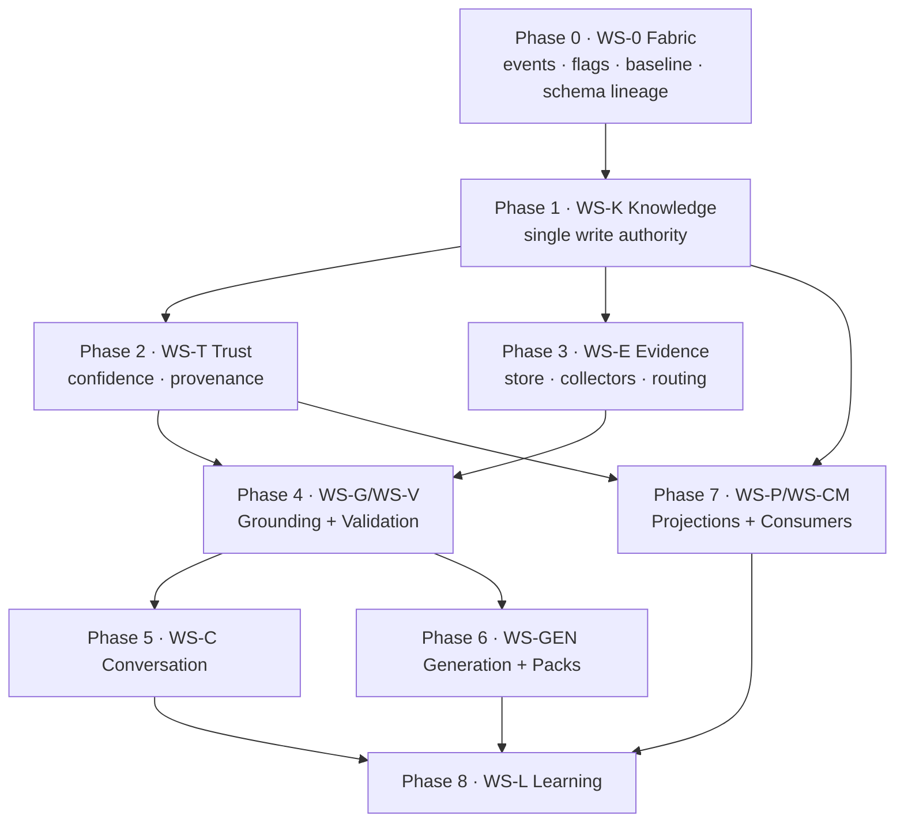

# Diagram — Dependency Graph

The phase/workstream dependency spine that fixes implementation order. Derived from IMPLEMENTATION-001 §3 and IMPLEMENTATION-003 §2.

## Workstream dependencies



## The three hard ordering laws

1. **Writes before everything** — WS-K is the first strangler seam; no context enforces before it. GATE-1 is the master gate.
2. **Trust ∥ Evidence** — independent after GATE-1; they share no files and both depend only on Knowledge.
3. **Grounding is the convergence** — WS-G/WS-V cannot assemble a context until Facts (WS-K), Confidence (WS-T), and Evidence (WS-E) are each authoritative. GATE-4 is the convergence gate.

## Parallelizable vs. blocking

| Can develop concurrently | Hard-blocked |
|---|---|
| WS-T ∥ WS-E (after GATE-1) | nothing before WS-0 |
| WS-C ∥ WS-GEN (Phase 5/6) | nothing writes-adjacent before WS-K |
| WS-G co-develops WS-V | WS-G needs WS-T + WS-E |
| Projection families (P2 ∥ P3) | WS-V needs WS-T |
| Frontend sections (Phase 7) | WS-CM needs WS-P |
| Within-context sub-steps | WS-L needs all emitting (terminal) |

## Synchronization points

```
GATE-1  ── all branches re-baseline on the write authority
GATE-4  ── all generation-adjacent work re-baselines on grounding+validation
GATE-7  ── constitution in force for consumers
GATE-8  ── constitution fully in force (platform self-measuring)
```

## Cross-context integration seams (who consumes whom)

| Program | Consumes |
|---|---|
| Trust [I2B] | Knowledge mutation hooks [I2A §8] |
| Evidence [I2C] | Knowledge (as mutation basis) [I2A §5]; supplies Trust dimension [I2B §4] |
| Grounding+Validation [I2D] | Knowledge [I2A §9] + Trust [I2B §11] + Evidence [I2C §4] |
| Conversation [I2E] | Grounding+Validation [I2D]; Knowledge [I2A §5]; Evidence [I2C §4] |
| Generation [I2F] | Grounding+Validation [I2D]; emits confidence signal to Trust [I2B §4] |
| Projections [I2G] | Knowledge [I2A §9] + Trust [I2B §11] |
| Learning [I2H] | all emitted events (terminal consumer) |
