# Diagram — Ownership Map

Which context owns which concern, and the singleton authorities. Derived from DESIGN-002 §2/§15 and each context program's boundary section.

## The six bounded contexts

```mermaid
graph TB
    subgraph IDENTITY [Identity Context]
        ID[Company · Website · Domains · Tenancy]
    end
    subgraph EVIDENCE [Evidence Context]
        EV[Evidence Objects · Observations · Collection Policy · Freshness]
    end
    subgraph KNOWLEDGE [Knowledge Context]
        KN[Facts · Relationships · State · Versions · Contradictions · Locks]
    end
    subgraph TRUST [Trust Context]
        TR[Confidence · Provenance · Lineage · Review · Learning Signals]
    end
    subgraph GENERATION [Generation Context]
        GEN[Workflows · Prompts · Models · Industry Packs · Conversation Engine]
    end
    subgraph DISTRIBUTION [Distribution Context]
        DI[Grounding Authority · Validation Pipeline · Projections · Consumers]
    end

    IDENTITY --> EVIDENCE
    EVIDENCE --> KNOWLEDGE
    KNOWLEDGE --> TRUST
    KNOWLEDGE --> DISTRIBUTION
    TRUST --> DISTRIBUTION
    GENERATION --> KNOWLEDGE
    DISTRIBUTION --> GENERATION
    TRUST -.recommends.-> GENERATION
```



## Ownership matrix

| Concern | Owner | Single authority? |
|---|---|---|
| Identity & website | Identity | — |
| Raw observations, collection policy | Evidence | — |
| Facts, state, versions, locks | **Knowledge** | **one write authority** (P3) |
| Confidence, provenance, review, lineage | **Trust** | **one confidence engine** (P12) |
| Grounding assembly | **Distribution** | **one grounding authority** (P11) |
| Validation | Distribution | one validation pipeline |
| Prompts, models, packs, workflows | Generation | governed assets (P16) |
| Conversation | **Generation** | **one conversation engine** (P4) |
| Projections | Distribution | derived (P26) |
| Learning / calibration | Trust (learning loop) | recommends only (P14) |

## The 14 ownership conflicts (all closed)

From AUDIT-002 §6, each closed structurally:

```
C1  10 write authorities        → P3   one writer          [I2A]
C2  4 grounding authorities      → P11  one grounding       [I2D]
C3  KG vs Canonical Context      → one knowledge graph      [I2A/I2D]
C4  report_settings replace race → merge-only mutations     [I2A]
C5  competitors null-then-write  → single write path        [I2A]
C6  confidence key mismatch      → one vocabulary + registry [I2B]
C7  classifier overrides user    → authority class (P8)      [I2A]
C8  phantom locks                → real locks (P25)          [I2A]
C9  read initiates write         → reads pure (P2)           [I2D]
C10 ungated intelligence channel → grounding authority       [I2D]
C11 dual notification stacks     → one event bus (P23)       [I2G]
C12 hand-maintained registry     → derived from declarations [I2G]
C13 conversation-state absent    → one engine                [I2E]
C14 tenancy by discipline        → structural (P21)          [all]
```

## The custody rule (Phase-1 transitional)

During Phase 1 only, the Knowledge write authority **arbitrates** the shared `report_settings` sub-keys on behalf of other domains (fingerprints, refresh state, orchestration ledger) — transitional custody, not ownership, ending when those domains' contexts stand up. See I2A §3.
