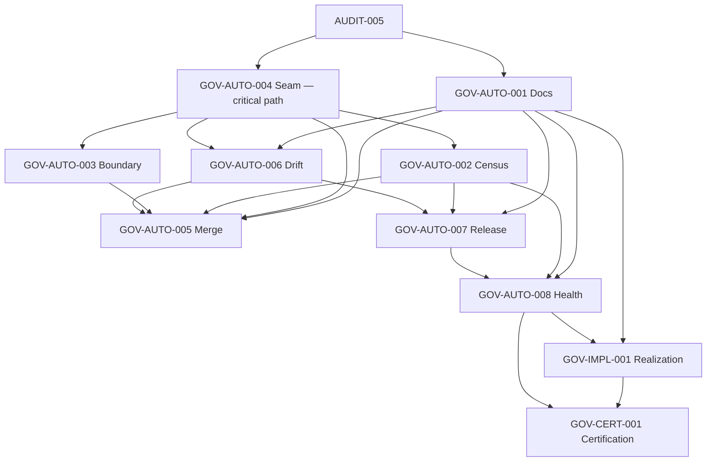

# Diagram — Governance Dependency Graph

The GOV-AUTO build/runtime/enforcement dependency DAG, from GOV-IMPL-001 §3. Enforcement order is orthogonal (paced by platform GATE-0..8).

## Build-order DAG

## Dependency table

| Program | Build depends on | Feeds |
|---|---|---|
| GOV-AUTO-001 Docs | — (independent) | 005, 006, 007, 008, IMPL |
| GOV-AUTO-004 Seam | code-model tooling; existing analyzers | 002, 003, 006 (detection foundation) |
| GOV-AUTO-002 Census | 004 | 005, 007, 008 |
| GOV-AUTO-003 Boundary | 004 | 005 |
| GOV-AUTO-006 Drift | 001, 004 | 005, 007 |
| GOV-AUTO-005 Merge | 001, 004, 002, 003, 006 | IMPL/CERT (aggregation) |
| GOV-AUTO-007 Release | 001–006 | 008, CERT |
| GOV-AUTO-008 Health | shared schema (001–007) | IMPL, CERT |
| GOV-IMPL-001 | all runtimes | CERT |
| GOV-CERT-001 | 001–008, IMPL | terminal |

## The three ordering laws (GOV-IMPL-001 §3)

1. **{001, 004} lead** — no build prerequisites; 001 fully independent, 004 the detection foundation (critical path, ~35% pre-built per IMPLEMENT-GOV-001).
2. **002/003/006 depend on 004**; 006 also on 001.
3. **005/007 aggregate the layer below; 008 consumes all; CERT certifies all.** No cycles.

**Related:** [governance-dependency in GOV-IMPL-001](../realization/GOV-IMPL-001.md) · [program-to-migration-gate-map](program-to-migration-gate-map.md) · [relationships](../appendices/relationships.md).
